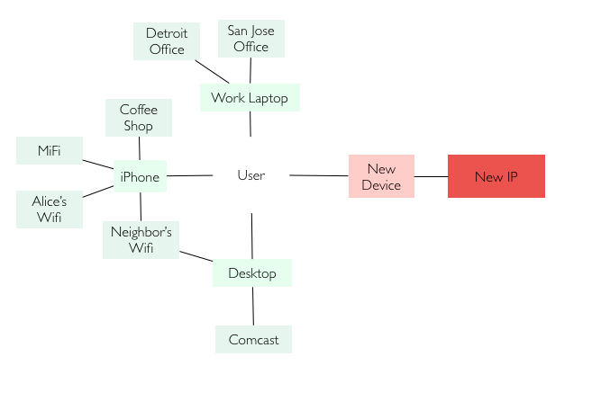

# AuthTables
[](https://travis-ci.com/magoo/AuthTables)

AuthTables is a service that prevents (or detects) "Account Take Over" caused by simple credential theft. If bad actors are stealing your users passwords, AuthTables may be useful.

AuthTables depends on no external feeds of data, risk scores, or machine learning. Your own authentication data will generate a graph of known locations for a user as they authenticate with known cookies or IP addresses. Every new login from a previously known IP or Cookie makes this graph stronger over time as it adds new locations for the user, reducing their friction and increasing their security.

## Threat

AuthTables is solely focused on the most common credential theft and reuse vector. Specifically, this is when an attacker has a victim's username and password, but they are not on the victim's host or network. This specific threat _absolutely cannot operate_ within the known graph of users historical locations, unless they are a totally different type of threat altogether.

This the most common and most accessible threat that results from large credential dumps and shared passwords.

<pre>
┌──────────────────────────────┐ ┌──────────┐
│                              │ │ Malware  │
│                              │ └──────────┘
│                              │ ┌──────────┐
│                              │ │   XSS    │
│                              │ └──────────┘
│                              │ ┌──────────┐
│   Trivial Credential Reuse   │ │   MITM   │
│                              │ └──────────┘
│                              │ ┌──────────┐
│                              │ │  Theft   │
│                              │ └──────────┘
│                              │ ┌──────────┐
│                              │ │ PW Reset │
└──────────────────────────────┘ └──────────┘
</pre>

By being so simple and accessible, simple credential theft and ATO generally makes up for far more than half of the abuse issues related to ATO, while the constellation of other problems (local malware, malicious browser extensions, MITM) usually make up the rest at most companies.

AuthTables focuses solely on this largest problem, and logically reduces the possibility that an authentication is ATO'd by making it clear that the auth came from a known device or location that a trivial attacker couldn't possibly have used.

If fraud *does occur* after your systems have challenged the user, you can logically conclude that the user has suffered a much more significant compromise than a trivial credential theft.

## Opportunity
The attack limitations of simple credential thief creates an opportunity for us to build an ever growing graph of known locations a user authenticates from. A credential thief is limited to operating outside of this graph, thus allowing us to treat those authentication with suspicion.



Your application may have methods to add locations to this graph, for example:

- Email registrations or link clicks
- Multifactor authentications
- Other risk-based signals based on ML
- Manual intervention from customer support
- Older logins that have never been abusive

These are example verifications that simple credential thieves will have significant hurdles or friction to manipulate, allowing you to increase the size of your users known graph. You'll do this by sending verified locations to `/add`.

Additional verifications entirely dependent on your own risk tolerance. A bitcoin company, for instance, may require true MFA to add a location, whereas a social website may `/add` a location to the users graph if they've clicked on a link in their email.

AuthTables assumes that your authentication service assigns as-static-as-possible cookies or identifiers to your users clients, as it uses this to learn new IP addresses your users connect from.

This allows less friction to the user and greatly reduces the need to prompt for MFA or other out-of-band-verifications. It also strongly identifies that a user is compromised by a more localized attack, or ATO of their registration email, allowing for much easier support scenarios to mitigate the user.

## Detection
It's entirely possible to limit AuthTables to only logging duty with no interference or interaction with your users. Implement custom alerting on your logs and can discover IP addresses or machine identifiers that are frequently appearing as suspicious logins which may surface high scale ATO driven attacks on your application.

## Protocol

AuthTables receives JSON POSTs  to `/check` containing UID, IP, and Machine ID.

`{
  "ip":"1.1.1.1",
  "mid":"uniqueidentifier",
  "uid":"magoo"
  }`

AuthTables quickly responds whether this is a known location for the user. If either MID or IP is new, it will add this to their known locations (Response: "OK") which grows their graph. If both are new, there is significant possibility that this account is taken over (Response: "BAD"), and should trigger a multifactor or email confirmation or other way of mitigating risk of ATO for this session. After this challenge, you can `/add` the session to their graph, allowing them to operate in the future without challenges.

## Limitations

- Extra Paranoid users who frequently change hosts and clear cookies (VPN's and Incognito) will frequently appear as credential thiefs
- Authentications from users victimized by malware require very different approaches, as they will have access to their local machine identification and network
- AuthTables cannot dictate how you will challenge a user who appears suspicious, but methods outside of true MFA may have their own vulnerabilities. For instance, email confirmation may suffer from a shared password with the original victim, allowing an attacker to confirm themselves as a real user.
- Localized, personal account takeover, like "Friendly Fraud". These sorts of attacks may share a laptop or wifi, both of which would bypass protections from AuthTables.

## Running With Docker

```bash
# build the container
docker-compose build
# run with a local redis
docker-compose up
# Send a test post request
function post {
  curl localhost:8080/check \
   -H "Content-Type: application/json" \
   -XPOST -d \
   "{ \"ip\":\"$1\",
      \"mid\":\"$2\",
      \"uid\":\"magoo\"
    }"
}
# First Post
post "1.1.1.1" "ID-A"
> GOOD
# Second Post (Good)
post "1.1.1.1" "ID-B"
> GOOD
# Brad New Post (Bad)
post "2.2.2.2" "ID-C"
> BAD
```
